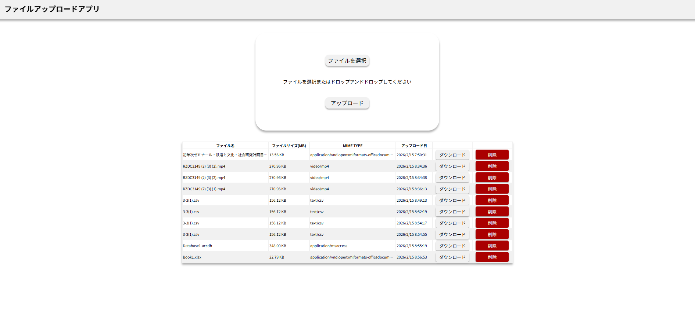

# vite と fastAPIのフルスタックファイルアップロード、ダウンロードアプリ

## 起動方法
docker compose build --no-cache　キャッシュ無しでビルド  
docker compose up コンテナの起動  

## リンク
[swagger](http://localhost:8000/docs)  
[フロントエンド](http://localhost:5173)  
## 実際の画面

## 学んだこと
テーブルを作るときはcreate_allをする前にTable情報が参照されていないとテーブルが作られない  
def create_db_and_tables():　　  
    from ..models.file import TableFile  　　
    SQLModel.metadata.create_all(engine)　　 
トランザクション前後で整合性を合わせるためにDB保存が失敗した後は、物理ファイルも削除するようにする  
datetime.now(Zoneinfo("Asia/Tokyo"))で日本時間の取得が確実にできる  
response_model=型　を使えばfastAPIが自動で変換してくれるから処理が簡単になる  
意外とvanilla typescriptでもDOM操作は関数として切り出すことでDRYをしないでいいところが出てくることが分かった　　

## 工夫した点  
保存されているものと画面の状態を合わせるためにDBのトランザクションを中心に考えダウンロード、削除ボタンで対応するレコードについての操作を実行できるようにした　　
ドラッグアンドドロップの実装を行いUXの向上を図った  
親要素にイベント委譲することでメモリ効率よくボタンに対してイベントを割り振ることができた　　
vanilla typescript, vanilla cssという素のフロントエンドで構築することで、今後のフレームワークを用いた開発を始めるときのロジックの裏側を自らの手で実装したこと  
CSSではDRYに書くところ、あえて同じことを書くことで独立性、依存関係を調整して今後の拡張をしやすいようにした  